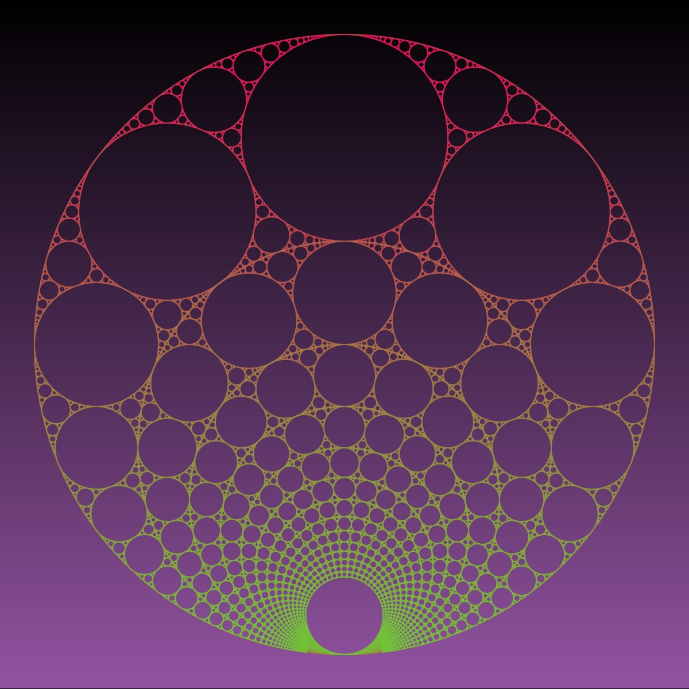

# Apollonian-Gasket

“The Kiss Precise” by Frederick Soddy

Four circles to the kissing come
The smaller are the benter.
The bend is just the inverse of
The distance from the center.
Though their intrigue left Euclid dumb,
There’s now no need for rule of thumb.
Since zero bend’s a dead straight line,
And concave bends have minus sign,
The sum of the squares of all four bends
Is half the square of their sum.

This repo contains code to render the Apollonian gasket. The Apollonian gasket is a special kind of circle packing where you start with a big circle and then fit smaller circles inside it, each touching the big circle and each other.

Descartes' formula is a mathematical formula that helps us understand the relationships between circles when they're packed together like in the Apollonian gasket.

Here's the idea: for any three circles that are mutually tangent (meaning they touch each other externally), there's a neat formula that relates the curvatures (or how "bendy" they are) of these circles. The formula is:

$(k_1 + k_2 + k_3)^2 = 2(k_1^2 + k_2^2 + k_3^2)$

Here, $k1$, $k2$, and $k3$ are the curvatures of the circles. The curvature of a circle is just the reciprocal of its radius. So if you have a big circle with radius $R$, its curvature is $1/R$.

Now, in the Apollonian gasket, we start with three circles inside a larger circle. These circles are tangent to each other and the big circle. Using Descartes' theorem, we can find the curvatures of these circles and use them to find the curvatures of the smaller circles we pack inside them, and so on.

The cool thing about this theorem is that it applies not just to three circles but to any number of circles that are all tangent to each other. So as we keep adding smaller circles into the gaps, we can keep using Descartes' theorem to understand how they all fit together. It's named after the ancient Greek mathematician Apollonius, who was really good at studying shapes and curves.

The [code](https://editor.p5js.org/codingtrain/sketches/zrq8KHXnO) for most of the versions is adapted from [Daniel Shiffman](https://thecodingtrain.com) -- Apollonian Coding Challenge coming soon!

The code for the nested version is from [Richard Bourne](https://openprocessing.org/user/162823?view=sketches&o=48) (I have updated the syntax a little bit.) The python and circle inversion code sets actual pixels, so it can't be adapted like Daniel's code. The python code is from user [FB36](https://code.activestate.com/recipes/users/4172570/) posted in ActiveStateCode. I obtained the circle inversion code by posting the python code in ChatGPT3.5 and asking it to port to p5.js. It did a pretty decent job--I only had to modify the loop slightly.

## 🌄 Gallery

<!-- IMAGE-LIST:START - Do not remove or modify this section -->
<!-- prettier-ignore-start -->
<!-- markdownlint-disable -->
<table>
  <tbody>
    <tr>
      <td align="center"><a href="">  <b> Apollonian gasket with polar pentagons</b></a></td>
      <td align="center"><a href="">  <b> Apollonian gasket with polar triangles</b></a></td>
     <td align="center"><a href="">  <b> Apollonian gasket with Phyllotaxis</b></a></td>
     <td align="center"><a href="">  <b> </b>Apollonian gasket with polar curve</a></td>
    </tr>
<tr>
      <td align="center"><a href="">  <b> Apollonian gasket with clocks</b></a></td>
      <td align="center"><a href="">  <b> Apollonian gasket with spheres</b></a></td>
     <td align="center"><a href="">  <b> Apollonian gasket with gears</b></a></td>
     <td align="center"><a href="">  <b> Apollonian gasket with polygons</b></a></td>
    </tr>

<tr>
      <td align="center"><a href="">  <b> Apollonian gasket with flowers</b></a></td>
      <td align="center"><a href="">  <b> Apollonian gasket with butterflies</b></a></td>
     <td align="center"><a href="">  <b> Apollonian gasket with 4 initial circles</b></a></td>
     <td align="center"><a href="">  <b> Nested Apollonian gasket</b></a></td>
    </tr>
 </tbody>
</table>

<!-- markdownlint-restore -->
<!-- prettier-ignore-end -->

<!-- IMAGE-LIST:END -->

## References

- [Single Line Apollonian Gaskets:
  Is The Limit a Space Filling Fractal Curve?](https://arxiv.org/pdf/2204.05729.pdf)
- [Single Line Apollonian Gaskets for Fashion](https://archive.bridgesmathart.org/2022/bridges2022-119.pdf)
- [Soddy Circles](https://mathworld.wolfram.com/SoddyCircles.html)
- [Apollonian Gasket](http://www.malinc.se/math/geometry/apolloniangasketen.php)
- [A Tisket, a Tasket, an Apollonian Gasket](https://www.americanscientist.org/article/a-tisket-a-tasket-an-apollonian-gasket)
- [A Visual Solution to the Apollonian Problem](http://laelcosta.com/demo3.js)
- [Apollonian circle packings: Dynamics and Number theory](https://users.math.yale.edu/~ho2/doc/Oh_ICWM.pdf)

Processing code examples
https://openprocessing.org/browse/?time=anytime&type=all&q=apollonian#
https://openprocessing.org/sketch/1878906
Processing
